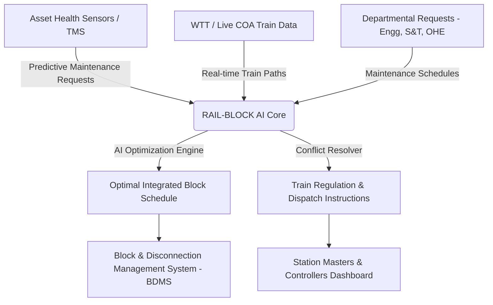
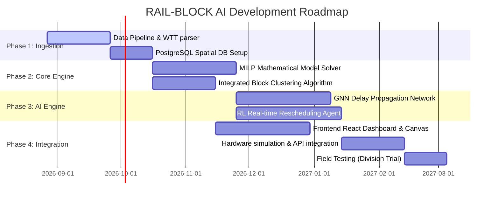

# Project Implementation Plan: RAIL-BLOCK AI
## AI-Powered Automatic Block Planning to Maximize Asset Availability for Train Operations on Indian Railways
**Problem Statement ID:** SIH26027 | **Sponsoring Ministry:** Ministry of Railways | **Theme:** Transportation & Logistics

---

## 1. Executive Summary & Problem Context

### 1.1 The Operational Challenge
In Indian Railways (IR), maintaining high asset availability (tracks, signaling systems, Overhead Equipment - OHE) is paramount for safety and efficiency. To conduct maintenance, divisions must enforce a **Block**—a temporary suspension of train traffic on a specific track section. 

Currently, block planning is heavily manual and fragmented across three primary maintenance departments:
1. **Engineering (Civil):** Track tamping, rail grinding, track renewal, deep screening.
2. **Electrical (TRD):** Overhead Equipment (OHE) inspection, wire replacement, insulator cleaning.
3. **Signalling & Telecom (S&T):** Point machine testing, interlocking checks, axle counter maintenance.

**Manual planning leads to critical bottlenecks:**
* **Departmental Silos:** Departments request blocks independently, leading to repeated, overlapping traffic disruptions on the same sections.
* **Operational Inefficiencies:** Traffic controllers manually search for gaps ("shadow hours") in the Working Time Table (WTT). This results in sub-optimal block duration or severe train delays.
* **Cascading Delays:** When a high-priority train is delayed, the scheduled block either gets cancelled (leading to maintenance arrears and speed restrictions) or causes severe secondary delays to other trains.
* **Machine Idle Time:** Expensive maintenance machinery (like Track Tamping Machines - CSM/Duomatic) remains idle due to poor coordination and delayed traffic approvals.

### 1.2 The RAIL-BLOCK AI Vision
Our solution, **RAIL-BLOCK AI**, is an intelligent, automated, and real-time decision-support system. It integrates train schedules, asset health data, and maintenance requests to automatically generate optimal, conflict-free block schedules. It maximizes maintenance throughput while minimizing train delay minutes using advanced mathematical optimization and AI.



---

## 2. System Architecture & Tech Stack

The architecture is built on high availability, real-time data streaming, and scalable optimization microservices.

```
+------------------------------------------------------------------------------------------------+
|                                    PRESENTATION LAYER (UI)                                     |
|  - React.js / Vite SPA (TailwindCSS, HTML5 Canvas, Chart.js)                                   |
|  - Real-time Time-Space String Chart (Interactive Gantt & Path Visualizer)                    |
|  - Controller Dispatch Console & Analytics Dashboard                                           |
+------------------------------------------------------------------------------------------------+
                                                 | (WebSockets / REST API)
                                                 v
+------------------------------------------------------------------------------------------------+
|                                      APPLICATION SERVICE                                       |
|  - FastAPI (Python Backend) / Node.js Express Gateway                                          |
|  - Redis Cache (Active Session Schedules & Train States)                                       |
+------------------------------------------------------------------------------------------------+
                                                 |
         +---------------------------------------+---------------------------------------+
         v                                       v                                       v
+------------------------+              +------------------------+              +------------------------+
|   DATA INGESTION BUS   |              |  OPTIMIZATION ENGINE   |              |       AI ENGINE        |
| - Kafka / RabbitMQ     |              | - Google OR-Tools      |              | - PyTorch (GNN Models) |
| - COA Sync (Live Train)|              | - Mixed-Integer Solver |              | - StableBaselines3 (RL)|
| - BDMS Sync (Requests) |              | - Integrated Heuristics|              | - Delay Predictor      |
+------------------------+              +------------------------+              +------------------------+
         |                                       |                                       |
         +---------------------------------------+---------------------------------------+
                                                 v
+------------------------------------------------------------------------------------------------+
|                                      DATA STORAGE LAYER                                        |
|  - PostgreSQL (PostGIS) -> Spatial Network Topology, Station & Section DB                      |
|  - MongoDB -> Historical Block Requests, WTT Logs, Maintenance History                         |
+------------------------------------------------------------------------------------------------+
```

### 2.2 Tech Stack Selection Rationale
* **Frontend:** React + Vite for a highly responsive, single-page application. We use HTML5 Canvas / SVG to render the complex **Time-Space String Charts** (which show train paths and blocks) with sub-second rendering times.
* **Backend:** FastAPI (Python) because of its high performance and native async support, allowing seamless integration with Python-based AI and OR libraries.
* **Optimization Core:** **Google OR-Tools** (for CP-SAT and MILP solvers) to solve deterministic scheduling problems under 30 seconds for a division.
* **AI Core:** **PyTorch** for Graph Neural Networks (GNN) to model railway topology and predict cascading delays. **Stable-Baselines3** for Reinforcement Learning (RL) to train the real-time rescheduling agent.

---

## 3. Mathematical Optimization & AI Core

To impress the judges, we present the exact mathematical formulations and AI algorithms driving our system.

### 3.1 The Optimization Objective (Mixed-Integer Linear Programming - MILP)
We model block planning as a resource-constrained scheduling problem. The objective function balances maintenance priority (maximizing work done) and operational efficiency (minimizing train delays).

$$\text{Minimize } Z = w_1 \sum_{t \in T} \text{Delay}(t) + w_2 \sum_{b \in B} (1 - S_b) \cdot \text{Cost}_b - w_3 \sum_{i \in I} \text{WorkProgress}(i)$$

Where:
* $T$: Set of all scheduled trains.
* $\text{Delay}(t)$: Total arrival delay of train $t$ at its destination.
* $B$: Set of maintenance block requests.
* $S_b \in \{0,1\}$: Binary variable indicating if block $b$ is approved ($1$) or deferred ($0$).
* $\text{Cost}_b$: Asset penalty cost of deferring maintenance block $b$ (increases over time as maintenance is delayed).
* $I$: Set of integrated blocks.
* $w_1, w_2, w_3$: Weight factors adjustable by the controller (e.g., prioritizing punctuality during peak passenger hours vs. prioritizing maintenance during night slots).

#### Constraints:
1. **Safety Separation:** No train $t$ can occupy section $s$ during an approved block $b$ on the same section:
   $$[Arrival(t, s), Departure(t, s)] \cap [Start(b), End(b)] = \emptyset \quad \forall b \in B_{approved}$$
2. **Integrated Maintenance Constraint:** If multiple departments request blocks on the same section $s$, their start and end times are clustered to form a single window:
   $$Start(I) = \min_{b \in I} Start(b), \quad End(I) = \max_{b \in I} End(b)$$
3. **Loop Line Capacity Constraint:** The number of regulated (stopped) trains at station $S$ cannot exceed the station's loop line capacity:
   $$\sum_{t} \text{IsRegulated}(t, S, \tau) \le \text{LoopLines}(S) \quad \forall \tau$$

### 3.2 The AI Algorithms

#### A. Graph Neural Networks (GNN) for Delay Propagation
Traditional timetabling algorithms fail because train delays propagate non-linearly. We represent the railway network as a dynamic graph:
* **Nodes ($V$):** Stations. Node features include loop line occupancy, current weather, and station type.
* **Edges ($E$):** Track sections (single/double line). Edge features include length, speed limits, and gradients.
We train a **Spatio-Temporal Graph Convolutional Network (ST-GCN)** to predict the future delay of all trains across the division given a proposed block schedule. This acts as the evaluator for our optimization search.

#### B. Deep Reinforcement Learning (DRL) for Real-Time Rescheduling
When live train tracking shows deviations (e.g., a train is running 40 minutes late), the optimization engine must run in milliseconds. We deploy a **Proximal Policy Optimization (PPO)** agent trained on simulation environments:
* **State Space:** Current positions, delays of all trains, and active/upcoming maintenance blocks.
* **Action Space:** Regulate (stop at loop line), Reroute (via bypass), or Shift Block Window (delay/advance block).
* **Reward Function:** Negative sum of train delays + positive reward for successful block execution.

---

## 4. Key Innovative Features (Unique Value Propositions)

To secure the top spot, our project implements features that go beyond basic scheduling:

### 4.1 Multi-Department Integrated Block Coordinator (IBC)
* **How it works:** Instead of independent blocks, the system uses a clustering algorithm (DBSCAN-based) to detect spatial and temporal proximity of requests.
* **Value:** If S&T wants 1 hour for point testing and Civil wants 2 hours for track repairs at Section X, the system schedules a single **2-hour Integrated Block** where both teams work simultaneously, saving 1 hour of line downtime.

### 4.2 Rolling Block Programme (RBP) Integration (26-Week Horizon)
* **How it works:** Implements the Ministry of Railways' latest RBP guidelines. The system maintains a 26-week rolling calendar. Maintenance machines (like tamping machines) are scheduled weeks in advance.
* **Value:** Reduces machine idle time and allows freight operators to plan freight paths weeks ahead, avoiding cargo delays.

### 4.3 Intelligent Train Regulation Heuristics
* **How it works:** When a block is active, the system automatically  258determines which trains to stop (regulate) at preceding stations, which loop lines to use, and which trains to divert.
* **Value:** Prevents gridlocks where trains block the main lines behind the maintenance zone.

### 4.4 Automated OHE Power Block Sync
* **How it works:** The system checks if the maintenance requires a Power Block (OHE traction off). If yes, it automatically schedules blocks on adjacent tracks if safety rules dictate (e.g., high-voltage safety margins).

---

## 5. UI/UX Design & Dashboard Mockup

The user interface is designed for Divisional Traffic Controllers and Departmental Engineers.

### Key Screens:
1. **Interactive Time-Space String Chart (Master Scheduler):**
   * X-axis: Time (24 hours). Y-axis: Stations along the route.
   * Train paths are drawn as lines. The slope of the line represents speed.
   * Maintenance blocks are highlighted as semi-transparent colored blocks (e.g., Red for Track, Blue for OHE, Yellow for S&T).
   * Drag-and-drop capability allows controllers to shift block timings, instantly recalculating train path crossings.
2. **Maintenance Ingestion & Clustering Terminal:**
   * Where engineers log block requests.
   * Visualizes how individual requests are grouped into "Integrated Blocks".
3. **Operations KPI Board:**
   * Shows: Maintenance Efficiency Index, Train Punctuality Rate, Asset Availability Rate, and Delayed Passenger Minutes.

---

## 6. Implementation Timeline & Roadmap (26-Week Plan)



---

## 7. Strategic FAQ for Judges (Departmental Scrutiny Preparation)

Prepare your team to answer these high-value questions during the presentation:

* **Q1: How does your system handle real-time disruptions (e.g., a train breakdown)?**
  * **Answer:** "Our system uses a dual-engine approach. For long-term planning, we use the MILP solver. For real-time disruptions, our pre-trained Reinforcement Learning (RL) agent executes in milliseconds, proposing adjustments like regulating trains at nearby loop lines or delaying the maintenance block by a calculated window to avoid gridlock."
* **Q2: Maintenance departments will always fight for priority. How does the AI resolve disputes?**
  * **Answer:** "We use a multi-criteria optimization model with adjustable weights. The weights are governed by policies set at the Division/Zone level. For example, during high-priority passenger rush hours, train delay penalty ($w_1$) is high. During designated maintenance corridors (e.g., 12:00 AM - 4:00 AM), the asset maintenance priority ($w_3$) increases, encouraging the solver to grant blocks."
* **Q3: What data sources are required to run this in production?**
  * **Answer:** "We integrate with three existing Indian Railways systems: (1) **COA (Control Office Application)** for live train tracking, (2) **ICMS** for coaching train timetables, and (3) **BDMS (Block and Disconnection Management System)** for maintenance block requests. This ensures zero double-data entry."

---
*Created by the Project RAIL-BLOCK AI Team for the Smart India Hackathon 2026 Departmental Scrutiny.*
